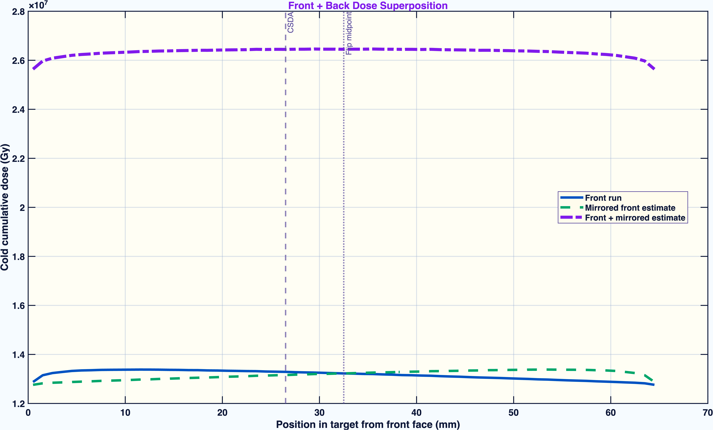
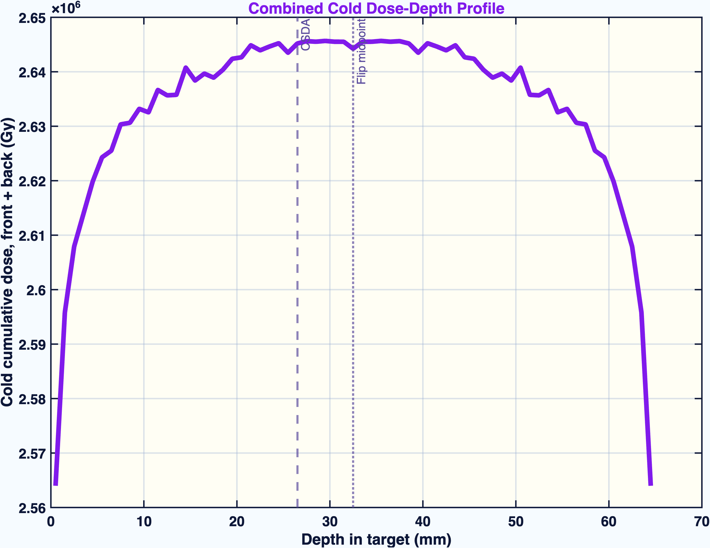
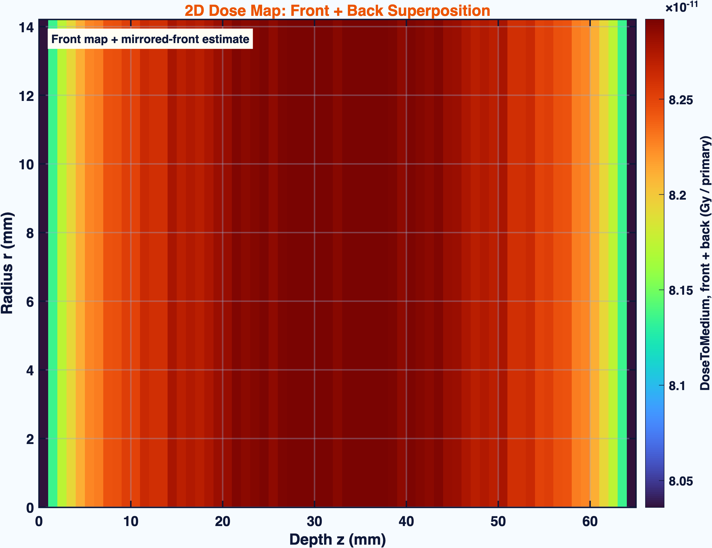
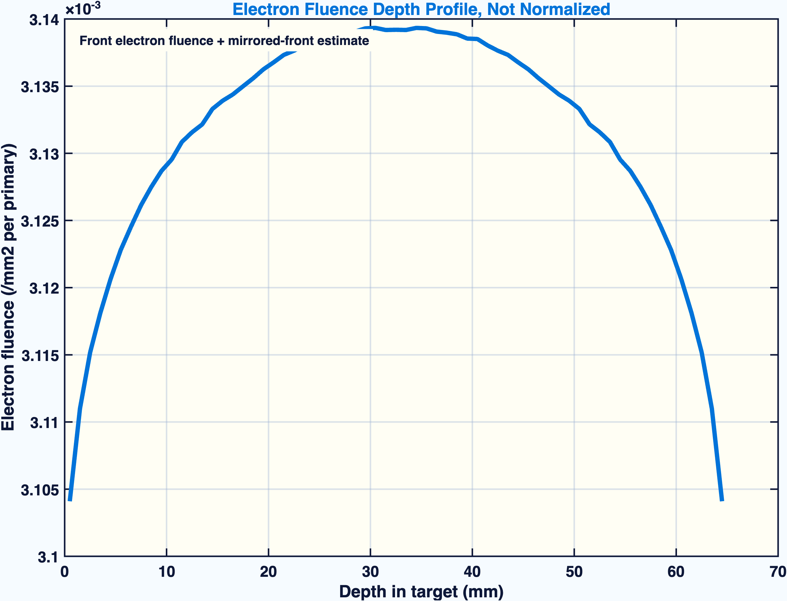
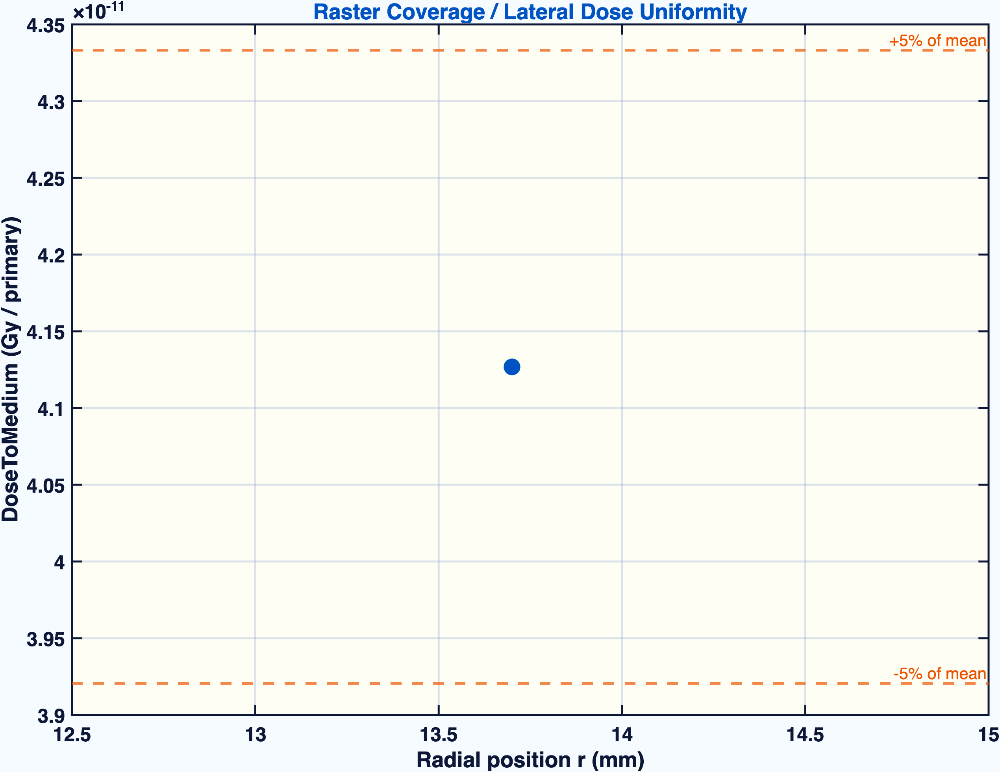
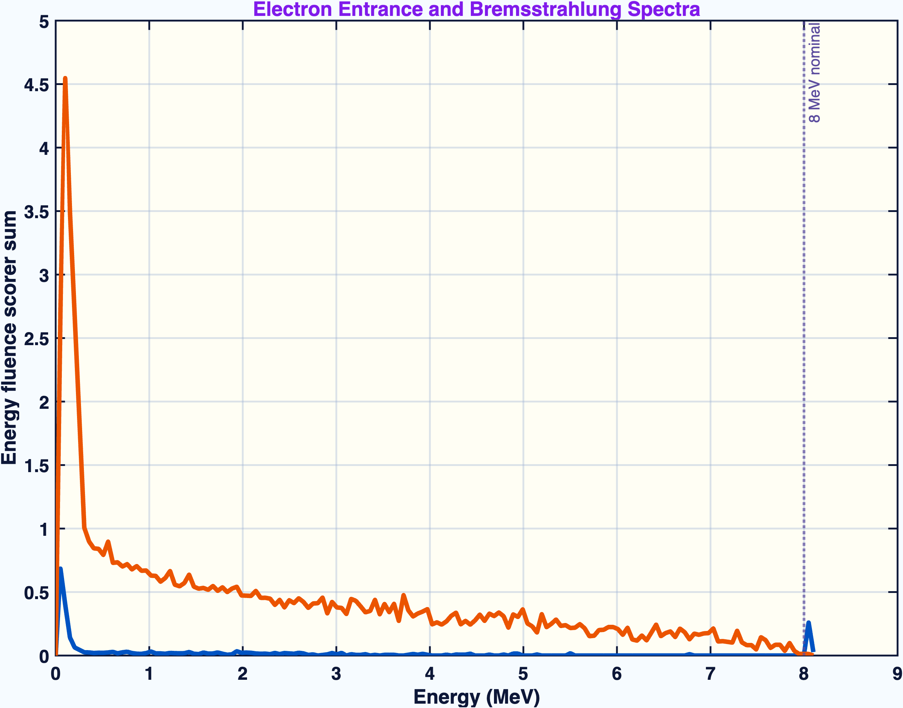
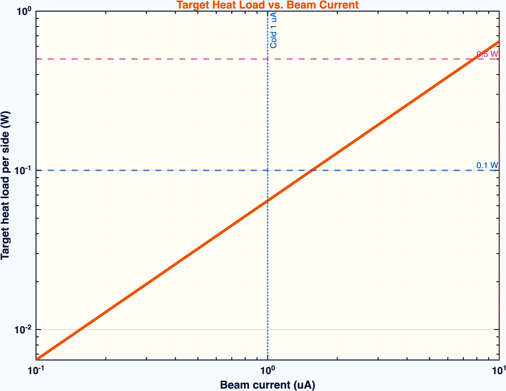
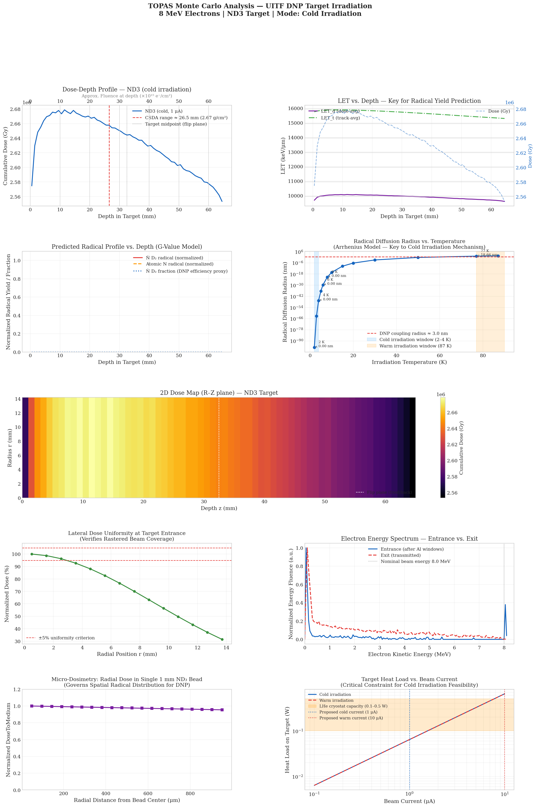

# Monte Carlo Assessment of Two-Sided \(8\,\mathrm{MeV}\) Electron Irradiation of Cryogenic ND3 for Polarized Target Preparation

**Samuel Takwirira**  
UNH DNP Group / Jefferson Lab Target Group Collaboration  
May 2026

## Abstract

Polarized solid targets based on ammonia require a controlled density of radiation-induced paramagnetic centers to support dynamic nuclear polarization (DNP) [3,4]. For deuterated ammonia (ND3), the irradiation procedure must be evaluated not only by the incident electron fluence, but also by the depth dependence of deposited dose, target-volume coverage, secondary radiation environment, and cryogenic heat load. A TOPAS/Geant4 Monte Carlo model [1,2] was developed to assess an \(8\,\mathrm{MeV}\) electron irradiation protocol for a packed cryogenic ND3 target at the Jefferson Lab Upgraded Injector Test Facility (UITF). The model includes the beam-spreading aluminum window, cryostat windows, liquid-helium bath, target-holder proxy, packed ND3 target volume, front and back electron sources, depth-dose scorers, radial-dose scorers, R-Z dose maps, fluence scorers, spectral diagnostics, and total energy-deposition checks.

Because the target length is \(6.5\,\mathrm{cm}\) [7], the simulation treats the irradiation as a two-sided protocol: one run irradiates the upstream face and a second run irradiates the downstream face. The back-side dose field is oriented into the same target coordinate system before summation. This distinction is essential: front and back exposures are sequential and must not be interpreted as simultaneous heat loads. The available completed front/back analysis, normalized per primary and scaled to proposal beam currents, gives a cold \(1\,\mu\mathrm{A}\) delivered fluence of \(4.97 \times 10^{15}\,\mathrm{e}^{-}\,\mathrm{cm}^{-2}\) per side and \(9.94 \times 10^{15}\,\mathrm{e}^{-}\,\mathrm{cm}^{-2}\) for the two-sided exposure. The mean cold cumulative dose is \(1.32 \times 10^{6}\,\mathrm{Gy}\) per side and \(2.63 \times 10^{6}\,\mathrm{Gy}\) after front/back exposure, with an estimated deposited power of \(0.064\,\mathrm{W}\) per active side. The warm \(10\,\mu\mathrm{A}\) case gives \(9.97 \times 10^{16}\,\mathrm{e}^{-}\,\mathrm{cm}^{-2}\) per side, \(5.29 \times 10^{7}\,\mathrm{Gy}\) mean two-sided cumulative dose, and \(0.644\,\mathrm{W}\) per active side.

The simulation supports a physically traceable two-sided irradiation protocol for polarized-target material preparation. It directly predicts electron/photon transport, dose, fluence, energy deposition, and heat load. It does not directly predict radical species, radical survival, annealing behavior, ESR spectra, or final DNP polarization; those material-response quantities require experimental benchmarking.

**Keywords:** polarized target, dynamic nuclear polarization, ND3, ammonia irradiation, electron irradiation, TOPAS, Geant4, dose, fluence, LET, cryogenic heat load.

## 1. Introduction

Solid ammonia targets are central to polarized fixed-target experiments because they combine high achievable nuclear polarization, comparatively favorable dilution factors, and strong radiation resistance under experimental beam conditions [3,4]. In these materials, DNP is enabled by unpaired electron spins associated with radiation-induced paramagnetic centers [4,5]. The irradiation step is therefore part of the polarized-target preparation physics, not merely an activation or handling procedure. It establishes the defect population that later couples to the nuclear spin system through microwave-driven polarization transfer and spin diffusion.

For ND3, the irradiation requirements are especially important because the deuteron polarization performance depends sensitively on the type, density, and spatial distribution of the radiation-induced centers [5,6]. A useful irradiation protocol must deliver sufficient ionization dose to the material while avoiding excessive thermal load and gross nonuniformity. The relevant observables are therefore not only total incident charge or beam time; they include electron fluence, deposited dose, dose uniformity, depth dependence, energy deposition rate, secondary radiation, and LET-like track-structure proxies.

This work presents a Monte Carlo assessment [1,2] of a two-sided \(8\,\mathrm{MeV}\) electron irradiation concept for cryogenic packed ND3. The simulation is designed around the specific polarized-target question: whether the beamline and target geometry can plausibly create a proposal-scale radiation field throughout the sample volume while maintaining a credible cold-operation heat load. The analysis is written in the language of polarized target preparation and DNP material quality.

## 2. Polarized-Target Irradiation Observables

### 2.1 Fluence

Fluence, \(\Phi\), is the number of particles incident on or crossing a unit area, commonly expressed here as \(\mathrm{e}^{-}\,\mathrm{cm}^{-2}\). In polarized ammonia preparation, fluence is a practical irradiation-control variable because facilities often prescribe an electron dose target as an integrated number of electrons per unit sample area. Fluence is not the same as absorbed dose: two beams with the same fluence can deposit different energy depending on energy, material composition, geometry, and scattering. In this work, fluence is used to compare the simulation to the proposal targets [7] of \(5.0 \times 10^{15}\,\mathrm{e}^{-}\,\mathrm{cm}^{-2}\) per side for cold irradiation and \(1.0 \times 10^{17}\,\mathrm{e}^{-}\,\mathrm{cm}^{-2}\) per side for warm irradiation.

### 2.2 Absorbed Dose

Absorbed dose, \(D\), is the energy deposited per unit mass of material, measured in gray [1], where \(1\,\mathrm{Gy} = 1\,\mathrm{J}\,\mathrm{kg}^{-1}\). For irradiated polarized targets, dose is relevant because radical production is driven by deposited ionization energy. The spatial distribution of dose matters: a target batch with large underdosed regions may have insufficient paramagnetic-center density, while localized overdosed regions can promote damage, heating, or nonuniform material response.

### 2.3 Linear Energy Transfer and LET-like Proxies

Linear energy transfer (LET) describes energy deposition per unit track length, often reported in \(\mathrm{keV}/\mu\mathrm{m}\). LET is relevant because the local ionization density can influence radical formation, recombination probability, and the balance of paramagnetic species. For low-energy electron transport in this TOPAS setup, a direct generic electron LET scorer is not treated as the primary observable. Instead, LET-like behavior is inferred in post-processing from deposited energy and fluence trends. These quantities should be used as track-structure indicators, not as direct chemical predictions.

### 2.4 Heat Load

At cryogenic temperature, deposited energy becomes a thermal-design constraint. The quantity of interest is deposited power during one active irradiation side. The front and back irradiations are sequential; therefore, the instantaneous heat load is the per-side load, not the sum of both sides. This distinction is central for assessing whether the cold irradiation case is compatible with the available refrigeration power.

### 2.5 Spectral and Secondary Radiation Diagnostics

The entrance electron spectrum verifies that the target sees the intended beam after upstream materials. Exit bremsstrahlung and gamma fluence contextualize shielding and background, but they are not primary DNP observables. They are included because a publishable irradiation study must demonstrate that the beam transport and secondary radiation environment are understood.

## 3. Simulation Method

### 3.1 Monte Carlo Transport

The simulation was implemented in TOPAS as a front end to Geant4 particle transport [1,2]. TOPAS is used here as a general Monte Carlo research tool for electron and photon transport in a polarized-target irradiation geometry. The physics emphasis is electromagnetic energy deposition in cryogenic target material and surrounding beamline components.

### 3.2 Beam and Geometry

The incident beam is an \(8\,\mathrm{MeV}\) electron beam rastered over a circular field of \(14.3\,\mathrm{mm}\) radius, corresponding to approximately \(6.42\,\mathrm{cm}^{2}\) interaction area [7]. The model includes a beam-spreading aluminum element, aluminum cryostat entrance and exit windows, a liquid-helium cold bath, a target-holder proxy, a packed ND3 target region, and downstream scoring and dump regions.

The target is modeled as a \(6.5\,\mathrm{cm}\) long cylindrical packed ND3 volume with radius \(1.42\,\mathrm{cm}\) [7]. The proposal-scale batch mass is \(250\,\mathrm{mg}\) [7]. Thus, the primary target material is represented as a bulk-average packed material distributed over the holder volume. This choice preserves the batch-level mass and heat-load normalization. A separate single-bead branch exists for microdosimetry checks, but the batch-level results are reported from the packed target volume.

### 3.3 Two-Sided Irradiation Protocol

The \(8\,\mathrm{MeV}\) electron range makes a one-sided exposure inadequate for representing the full \(6.5\,\mathrm{cm}\) target length. The protocol is therefore represented by two separate simulations:

1. Front-side irradiation: the beam enters the upstream target face.
2. Back-side irradiation: the beam enters the downstream target face.

The combined target-coordinate dose is:

\[
D_{\mathrm{FB}}(z) = D_{\mathrm{front}}(z) + D_{\mathrm{back,oriented}}(z),
\]

where \(D_{\mathrm{back,oriented}}(z)\) is the back-side dose profile expressed in the same coordinate system as the front-side result. This is a cumulative two-exposure dose. It is not a simultaneous two-beam heat-load condition.

### 3.4 Scorers

The principal scored quantities are:

- depth dose in packed ND3;
- R-Z dose map in packed ND3;
- radial dose uniformity;
- target energy deposition;
- fluence versus depth;
- entrance and exit target fluence;
- entrance electron energy spectrum;
- exit photon and bremsstrahlung spectra;
- target and cryogenic-bath energy-deposition checks;
- upstream backscatter.

These scorers form a validation chain: beam transport, target entry, longitudinal dose, radial coverage, secondary radiation, and deposited power are all checked before interpreting the irradiation as suitable for polarized-target preparation.

### 3.5 Normalization

TOPAS scorer sums are divided by the number of simulated primary electron histories to obtain per-primary values. Physical scaling to beam current uses:

\[
\dot{D}(z) = D_{\mathrm{primary}}(z)\frac{I}{e},
\]

where \(I\) is beam current and \(e = 1.602176634 \times 10^{-19}\) C. Cumulative dose is obtained by multiplying the dose rate by irradiation time per side. Deposited power is computed from total deposited energy per primary multiplied by the electron rate \(I/e\).

The operating points used for physical interpretation are taken from the proposal conditions [7]:

- cold irradiation: \(1\,\mu\mathrm{A}\), 1.42 hours per side;
- warm irradiation: \(10\,\mu\mathrm{A}\), 2.85 hours per side.

## 4. Results

### 4.1 Front and Back Depth-Dose Profiles

The front-only depth-dose profile is range-limited across the \(6.5\,\mathrm{cm}\) target length. The downstream/back exposure complements the front exposure when expressed in target coordinates. This is the central physics justification for two-sided irradiation.

**Figure 1.** Front-side, back-side, and front-plus-back cold cumulative dose profiles. The figure demonstrates why a one-sided \(8\,\mathrm{MeV}\) exposure is not a sufficient representation of the target-volume dose. The combined curve is the cumulative dose from two sequential exposures.

### 4.2 Combined Cold Dose Field

The combined front/back curve is the proposal-relevant target-coordinate dose field. For the cold \(1\,\mu\mathrm{A}\) case, the mean cumulative dose is \(1.32 \times 10^{6}\,\mathrm{Gy}\) per side and \(2.63 \times 10^{6}\,\mathrm{Gy}\) after front/back exposure.

**Figure 2.** Combined cold dose-depth profile for the two-sided irradiation protocol. This curve is the primary depth-dose result for cold ND3 irradiation.

### 4.3 R-Z Dose Map and Target Coverage

The R-Z map tests whether the rastered beam covers the target radius and whether the longitudinal dose field has obvious hot or cold regions. For polarized-target preparation, this is a material-quality question: large spatial nonuniformity would imply nonuniform radical density and potentially nonuniform DNP behavior across the batch.

**Figure 3.** R-Z dose map for the front-plus-back irradiation. The map provides the spatial check that the target volume, rather than only the central beam axis, is being evaluated.

### 4.4 Electron Fluence Through the Target

Fluence versus depth is a beam-transport diagnostic and a polarized-target irradiation metric. In this context, it shows how the electron population evolves through the target and supports the comparison between simulated irradiation and proposal fluence targets.

**Figure 4.** Electron fluence versus target depth. Fluence is reported as the number of electrons crossing unit area and is used to connect Monte Carlo transport to the integrated electron exposure prescribed for target-material irradiation.

### 4.5 Radial Dose Uniformity

Radial uniformity determines whether the rastered field gives a broad irradiation over the sample area. This is important because the radical inventory should be as uniform as practical across the batch, especially if material is later loaded into polarized target cells where local polarization and radiation resistance matter.

**Figure 5.** Lateral dose uniformity across the target radius. The figure checks whether the simulated raster provides broad target coverage rather than a narrow pencil-beam exposure.

### 4.6 Spectral Diagnostics

The entrance spectrum verifies the electron energy reaching the target. The photon spectrum at exit quantifies the bremsstrahlung environment. For polarized targets, the entrance electron spectrum is relevant to dose and radical production, while the photon spectrum is mainly a shielding and background diagnostic.

**Figure 6.** Entrance electron spectrum and exit photon/bremsstrahlung diagnostic. The plot supports the beam-transport validation chain and provides context for secondary radiation.

### 4.7 Heat Load

The estimated cold heat load is \(0.064\,\mathrm{W}\) per active irradiation side. The warm heat load is \(0.644\,\mathrm{W}\) per active side. Since the target is irradiated from one side at a time, these are not added as a simultaneous thermal load. The cold result is the most important cryogenic feasibility number because the target material must remain near the cold irradiation condition while radicals are produced.

**Figure 7.** Target heat load versus beam current. Deposited power is derived from total target energy deposition per primary and scaled by electron rate. This figure is used to assess compatibility with cold irradiation.

### 4.8 Supplemental Diagnostic Panel

The supplemental multi-panel diagnostic provides an independent analysis product from the same scorer family [1,2]. It includes dose-depth behavior, LET-like proxy behavior, radical-yield proxy visualization, diffusion-radius context, dose-map information, lateral uniformity, energy spectra, bead-dose information, and current-dependent heat-load scaling. This figure is retained as a compact record of the broader diagnostic workflow supporting the publication figures.

**Figure 8.** Supplemental multi-panel cold ND3 diagnostic summary. The panel is useful as a compact summary of the full post-processing workflow, including direct Monte Carlo quantities and derived polarized-target interpretation proxies.

### 4.9 Quantitative Summary

**Table 1. Proposal-scaled electron fluence, mean cumulative dose, and heat load.**

| Mode | Current | Proposal fluence per side | Delivered fluence per side | Front/back total fluence | Mean dose per side | Mean front/back dose | Heat load per active side |
|---|---:|---:|---:|---:|---:|---:|---:|
| Cold | \(1\,\mu\mathrm{A}\) | \(5.00 \times 10^{15}\,\mathrm{e}^{-}\,\mathrm{cm}^{-2}\) | \(4.97 \times 10^{15}\,\mathrm{e}^{-}\,\mathrm{cm}^{-2}\) | \(9.94 \times 10^{15}\,\mathrm{e}^{-}\,\mathrm{cm}^{-2}\) | \(1.32 \times 10^{6}\,\mathrm{Gy}\) | \(2.63 \times 10^{6}\,\mathrm{Gy}\) | \(0.064\,\mathrm{W}\) |
| Warm | \(10\,\mu\mathrm{A}\) | \(1.00 \times 10^{17}\,\mathrm{e}^{-}\,\mathrm{cm}^{-2}\) | \(9.97 \times 10^{16}\,\mathrm{e}^{-}\,\mathrm{cm}^{-2}\) | \(1.99 \times 10^{17}\,\mathrm{e}^{-}\,\mathrm{cm}^{-2}\) | \(2.64 \times 10^{7}\,\mathrm{Gy}\) | \(5.29 \times 10^{7}\,\mathrm{Gy}\) | \(0.644\,\mathrm{W}\) |

The cold delivered fluence is within approximately 1% of the target value, and the warm delivered fluence is within approximately 1% of the target value. This validates the current-time-fluence scaling used for the proposal operating points.

## 5. Discussion

The central result is that the target geometry cannot be interpreted using a one-sided \(8\,\mathrm{MeV}\) irradiation alone. The front/back protocol is required by electron range and energy-loss physics. This is directly relevant to polarized target preparation because the useful material property is not the dose at a single face, but the retained radical population across the target batch.

The calculation also separates irradiation quality from material-response interpretation. Dose and fluence establish where ionization energy is delivered. LET-like proxies provide limited track-structure context. However, the final paramagnetic-center population depends on radical formation, radical survival, recombination, temperature, annealing, and crystal-state effects. These are not computed directly by TOPAS. Electron spin resonance, NMR-based polarization measurements, or direct post-irradiation polarization tests are required before the simulation can be converted into a claim about final DNP performance [4-6].

The cold heat-load result is promising as a feasibility indicator. A deposited power of \(0.064\,\mathrm{W}\) per active side is within the scale where low-temperature operation may be plausible, subject to the actual refrigerator, thermal coupling, target holder, and beam structure. The warm heat load is larger but belongs to a different thermal environment and should be interpreted separately.

## 6. Model Scope and Experimental Benchmarks

The present calculation is best interpreted as a feasibility and beam-transport study for the proposed irradiation geometry. It establishes the dose, fluence, target-volume coverage, spectral diagnostics, and heat-load scale needed to evaluate the irradiation protocol, while leaving the final material-response observables to dedicated experimental benchmarks.

The packed ND3 target is represented as a batch-averaged mass distribution over the holder volume. This treatment is appropriate for proposal-scale fluence and heat-load normalization, and it preserves the relevant target mass for the reported dose estimates. A resolved bead-packing model would be a useful extension if bead-to-bead dose variation becomes a design driver. Similarly, the cryostat and holder are represented by physics-motivated proxy dimensions and should be updated as engineering drawings mature; this refinement would improve geometry fidelity without changing the central range-based conclusion that one-sided \(8\,\mathrm{MeV}\) exposure is insufficient over the full target length.

The LET-like and radical-yield proxy panels are used as diagnostic context for where ionization energy is deposited. They are not treated as direct predictions of radical species, radical survival, or electron chemical effectiveness. The simulation therefore motivates, rather than replaces, the experimental benchmarks most relevant to DNP material quality: ESR characterization of the irradiated radical population and NMR or polarization measurements after the proposed irradiation and thermal history.

For reproducibility, the tabulated values should remain tied to the archived production outputs and analysis-script version used for the final manuscript, so that each reported number can be traced to a single analysis provenance chain.

## 7. Conclusions

The Monte Carlo model supports the feasibility of a two-sided \(8\,\mathrm{MeV}\) electron irradiation protocol for cryogenic packed ND3 polarized-target preparation. The front-only dose field is range-limited over the \(6.5\,\mathrm{cm}\) target length, making back-side irradiation necessary for proposal-relevant target-volume coverage. The front/back cumulative dose field, electron fluence scaling, radial coverage, spectral checks, and heat-load estimate form a coherent validation chain for the irradiation concept.

For the cold \(1\,\mu\mathrm{A}\) case, the model delivers \(4.97 \times 10^{15}\,\mathrm{e}^{-}\,\mathrm{cm}^{-2}\) per side and estimates \(0.064\,\mathrm{W}\) target heat load per active side. For the warm \(10\,\mu\mathrm{A}\) case, the model delivers \(9.97 \times 10^{16}\,\mathrm{e}^{-}\,\mathrm{cm}^{-2}\) per side and estimates \(0.644\,\mathrm{W}\) per active side. These results support continued development of the irradiation protocol, with the key caveat that radical chemistry and final DNP polarization must be validated experimentally.

## Acknowledgements

This manuscript was prepared by Samuel Takwirira for the UNH DNP Group / Jefferson Lab Target Group collaboration. The work is motivated by polarized fixed-target material preparation and by the broader literature on irradiated ammonia targets for DNP [3-6].

## Data and Code Availability

The simulation cards, analysis scripts, scorer outputs, and figure assets are available in the shared UITF project folder. In the path table below, `UITF02/` denotes the top-level project directory. The embedded figure links in the manuscript are written relative to the manuscript location so that they render when the paper is opened from inside the project folder.

Figure assets are stored under:

`UITF02/figures_matlab/pptx_deck_assets/`

Figure-source mapping:

| Manuscript figure | Source file |
|---|---|
| Figure 1 | `UITF02/figures_matlab/pptx_deck_assets/01_front_back_superimposed_cold_dose.png` |
| Figure 2 | `UITF02/figures_matlab/pptx_deck_assets/02_combined_cold_dose_depth.png` |
| Figure 3 | `UITF02/figures_matlab/pptx_deck_assets/03_2d_dose_map_superimposed.png` |
| Figure 4 | `UITF02/figures_matlab/pptx_deck_assets/04_electron_fluence_depth_unnormalized.png` |
| Figure 5 | `UITF02/figures_matlab/pptx_deck_assets/06_lateral_dose_uniformity_raw.png` |
| Figure 6 | `UITF02/figures_matlab/pptx_deck_assets/07_energy_spectra.png` |
| Figure 7 | `UITF02/figures_matlab/pptx_deck_assets/08_heat_load_vs_current.png` |
| Figure 8 | `UITF02/figures/DNP_UITF_Analysis_ND3_cold.png` |

The quantitative summary table used for Table 1 is stored with the analysis
outputs in `UITF02/figures_matlab/`.

## References

[1] S. Agostinelli et al., "GEANT4 - A simulation toolkit," *Nuclear Instruments and Methods in Physics Research Section A*, vol. 506, no. 3, pp. 250-303, 2003. doi: 10.1016/S0168-9002(03)01368-8.  
[2] J. Perl, J. Shin, J. Schumann, B. Faddegon, and H. Paganetti, "TOPAS: An innovative proton Monte Carlo platform for research and clinical applications," *Medical Physics*, vol. 39, no. 11, pp. 6818-6837, 2012. doi: 10.1118/1.4758060.  
[3] D. G. Crabb and W. Meyer, "Solid polarized targets for nuclear and particle physics experiments," *Annual Review of Nuclear and Particle Science*, vol. 47, pp. 67-109, 1997. doi: 10.1146/annurev.nucl.47.1.67.  
[4] W. Meyer, "Ammonia as a polarized solid target material - a review," *Nuclear Instruments and Methods in Physics Research Section A*, vol. 526, issues 1-2, pp. 12-21, 2004. doi: 10.1016/j.nima.2004.03.145.  
[5] W. Meyer, K. H. Althoff, W. Havenith, and W. Thiel, "Dynamic deuteron polarization in irradiated D-ammonia (ND3) and its first use in a high energy photon beam," *Nuclear Instruments and Methods in Physics Research Section A*, vol. 227, no. 1, pp. 35-44, 1984. doi: 10.1016/0168-9002(84)90098-6.  
[6] A. Conover, V. Y. S. Bandara, D. Keller, and F. Bateman, "Bulk irradiation of ammonia for polarized target experiments," *Nuclear Instruments and Methods in Physics Research Section A*, vol. 1068, article 169717, 2024. doi: 10.1016/j.nima.2024.169717.  
[7] UNH-UITF BeamNetUS Proposal, internal project document.
